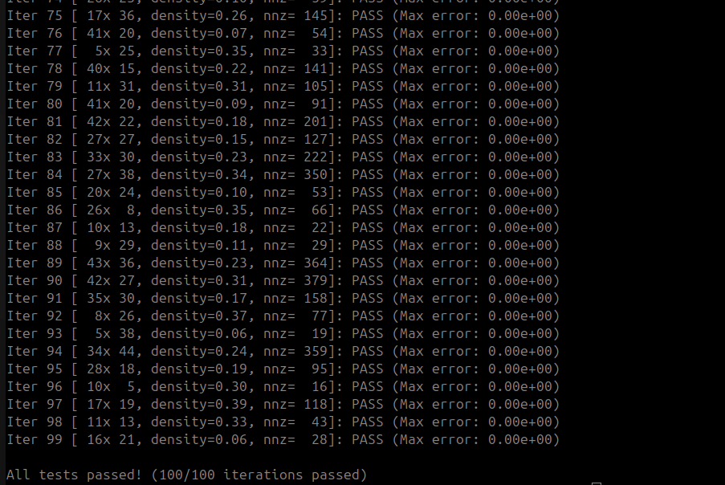

# RV-Sparse: Compressed Sparse Row Matrix-Vector Multiplication

A solution to the RV-Sparse coding challenge, implementing `sparse_multiply` in C with zero dynamic memory allocation.

## Problem Statement

Implement a function that:

1. Scans a row-major dense matrix `A` and identifies its non-zero elements.
2. Extracts them into Compressed Sparse Row (CSR) format using caller-provided buffers.
3. Computes the matrix-vector product `y = A * x` using the extracted CSR data.
4. Writes results directly into a caller-provided output buffer.

Critical constraint: no `malloc`, `calloc`, or any dynamic allocation inside the function. All memory is pre-allocated by the caller.

## Function Signature

```c
void sparse_multiply(
    int rows,
    int cols,
    const double* A,       // Input: row-major dense matrix (rows × cols)
    const double* x,       // Input: vector of length cols
    int*    out_nnz,       // In/Out: number of non-zero elements found
    double* values,        // Output: CSR non-zero values
    int*    col_indices,   // Output: CSR column indices
    int*    row_ptrs,      // Output: CSR row pointers (length rows+1)
    double* y              // Output: result vector of length rows
);
```

## CSR Format

Given a matrix like:

```
A = [ 1  0  2 ]
    [ 0  3  0 ]
    [ 4  5  6 ]
```

The CSR representation is:

| Field         | Values               |
|---------------|----------------------|
| `values`      | `[1, 2, 3, 4, 5, 6]` |
| `col_indices` | `[0, 2, 1, 0, 1, 2]` |
| `row_ptrs`    | `[0, 2, 3, 6]`       |

`row_ptrs[i]` is the index into `values`/`col_indices` where row `i` begins.
`row_ptrs[rows]` equals the total number of non-zero elements (`nnz`).

## Implementation

The core logic in `challenge.c`:

```c
void sparse_multiply(
    int rows, int cols, const double* A, const double* x,
    int* out_nnz, double* values, int* col_indices, int* row_ptrs,
    double* y
) {
    for (int i = 0; i < rows; i++)
        y[i] = 0.0;

    for (int i = 0; i < rows; i++) {
        row_ptrs[i] = *out_nnz;
        for (int j = 0; j < cols; j++) {
            double val = A[i * cols + j];
            if (val != 0.0) {
                values[out_nnz[0]]      = val;
                col_indices[out_nnz[0]] = j;
                y[i] += val * x[j];
                out_nnz[0]++;
            }
        }
    }
    row_ptrs[rows] = *out_nnz;
}
```

No heap allocation is performed. All buffers (`values`, `col_indices`, `row_ptrs`, `y`) are owned by the caller.

## Build & Run

```bash
gcc -o run challenge.c -lm
./run
```

## Test Results

The harness runs 100 randomised iterations, each with a different matrix size (5–45 rows/cols), sparsity density (5–40%), and input vector. Results are checked against a naive reference multiply with mixed absolute/relative tolerance of `1e-7`.



## Test Harness

The harness in `challenge.c` runs 100 randomised iterations, each with:

- A random matrix size (5–45 rows × 5–45 cols)
- A random sparsity density (5%–40% non-zero)
- A random input vector `x`
- Correctness verified against a naive reference implementation
- Tolerance: `|y_user[i] - y_ref[i]| ≤ 1e-7 + 1e-7 * |y_ref[i]|` (mixed absolute/relative)

## Files

```
challenge.c     (solution + test harness)
README.md
```
